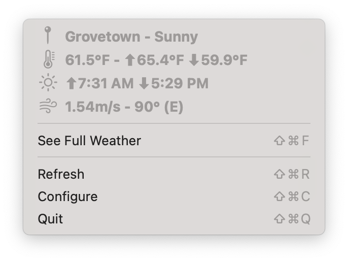
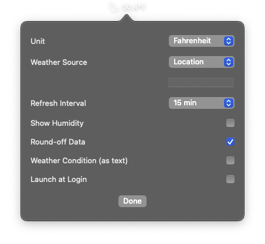
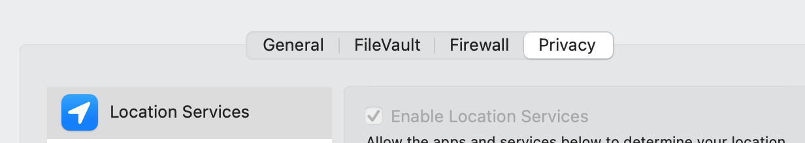
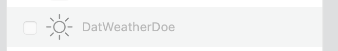

# [](image.png) DatWeatherDoe

> **Note**
OpenWeatherMap API 2.5 support is ending in June 2024. The app uses WeatherAPI going forward with location support.

- Fetch weather using:
  - Location services
  - Latitude / Longitude
- Configurable polling interval
- Dark mode support
- Supports MacOS 13.0+

## Screenshots

\


## Installation

### Homebrew Cask

`brew install --cask datweatherdoe`

### Manual

<https://github.com/inderdhir/DatWeatherDoe/releases/latest>

## Using Location Services

If using location, please make sure that the app has permission to access location services on macOS.

`System Preferences > Security & Privacy > Privacy > Location Services`




## Developer Setup

- Get your personal API key for WeatherAPI [here](https://www.weatherapi.com)
- Add the following in "Config.xcconfig":

```env
WEATHER_API_KEY=YOUR_KEY
```

## Donate

Buy me a coffee to support the development of this project.

[](https://ko-fi.com/Y8Y211O253)

## Contributing

Please see CONTRIBUTING.md
