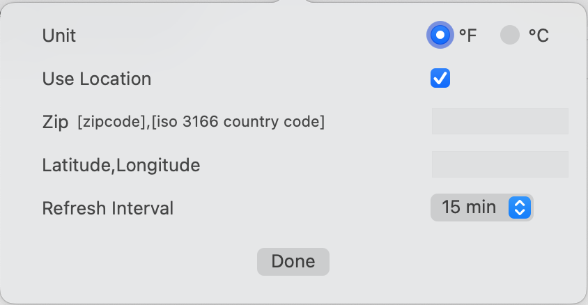

# DatWeatherDoe

✅ Location services / zip code support

✅ Configurable polling interval

✅ Dark mode support

# Setup

- Get your personal API key for openweathermap here: http://openweathermap.org/appid . 
- Set the value of "OPENWEATHERMAP_APP_ID" to your key in Keys.plist. 

[Download latest release](https://github.com/inderdhir/DatWeatherDoe/releases/latest)
