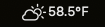

# DatWeatherDoe

✅ Fetch weather using: 
- Location services
- Zip Code
- Latitude / Longitude

✅ Configurable polling interval

✅ Dark mode support

✅ Supports macOS 10.12+

## Installation

[Download latest release](https://github.com/inderdhir/DatWeatherDoe/releases/latest) or install via Homebrew Cask:

    brew install --cask datweatherdoe

## Using Location Services

If using location, please make sure that the app has permission to access location services on MacOS.

`System Preferences > Security & Privacy > Privacy > Location Services`

## Developer Setup

- Get your personal API key for openweathermap here: http://openweathermap.org/appid 
- Set the value of "OPENWEATHERMAP_APP_ID" to your key in `DatWeatherDoe/Resources/Keys.plist`. 

## Donate

Buy me a coffee to support the development of this project.

## Contribute
Please see CONTRIBUTING.md